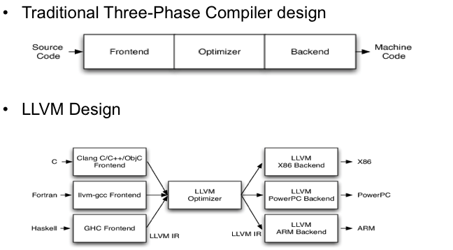

# Note

这是我写 Qython 时候的学习笔记，希望可以帮到大家  
感谢：
感谢知乎大佬 <a hraf = "https://www.zhihu.com/people/llwanghong">Hong</a> 的文章搬运

感谢 Github 大佬项目<a hraf = "https://github.com/PowerAngelXD/YoLang">YoLang</a>

写这个的时候也得罪了不少人（指我啥都不会）需要 Stars 回血

# 语言叙述

    int x = 10;
    println("Hello, World!")
    if (x == 10)
    {
        println("this is if")
    }
    //这一点也不像Python :-(

# 开始

## 编译器架构

-   前端
-   中端
-   后端

整体项目我们可以用llvm的演示图组举例子

llvm不是一个编译器，而是一个编译器的架构，llvm编译器架构通常能支持多种语言和多种架构，支持交叉编译：

-   如果想支持一个新的语言，写出前端就好了
-   如果想支持一个新的架构，写出后端就好了
-   如果你已经写完了，直接接入已有的llvm IR就好了

这种分架构的编写是一个屡试不爽的设计思路，本篇也按照这个思路写编译器

## Parser

### 要点

-   每个函数保证只做好一件事即可。
-   不要试图使用正则去做解析。但是你可以使用正则进项小部分解析。
-   当不确定如何解析某部分时，就当成错误抛出来。

代码以及实现应该分成四部分写 :

1. 字符流(Byte Stream)
2. Token 流(Lexer)
3. 语法解析器(Parser)
4. 抽象语法树(AST)

实际上，除了ast还有三地址码，但是这里不做介绍，详细请看《编译原理》

字符流我们可以用循环写，依靠字符串切片模拟字符流

-   line
-   column
-   pos

Token 一般长这样(这只是例子)

    { type: "punc", value: "(" }           // punctuation: parens, comma, semicolon etc.
    { type: "num", value: 5 }              // numbers
    { type: "string", value: "Hello World!" } // strings
    { type: "string", value: "a" }            // identifiers
    { type: "op", value: "!=" }

我们用 var a = 10 来举例子

    Token : < VAR | - >
    Token : < IDENTIFIER | a >
    Token : < E | - >
    Token : < NUMBER | 10 >

"|" 可以被任何分隔符号代替，Qython 用的是",", 使用的是列表 + 元组的形式

在`./source/lexer.py`中的 `def Token(value)`函数中

在 lexer.py 中，pos 永远指向下一位

我不打算考虑除了英文以外的字符，因为这是个练手项目

当前阶段，Example.qy 长这个样子 :

    "NMSL"11451N
    int x;

会输出 Token 流：

    [('STRING', 'NMSL', 1, 5, 6),
    ('NUMBER', '11451', 1, 5, 11),
    ('UNDEFINE', 'N', 1, 5, 12), 
    ('ENDER', None, 2, 6, 13),
    ('INT', None, 2, 6, 16),
    ('IDENTIFIER', 'x', 2, 6, 18),
    ('ENDER', None, 3, 8, 20)]

P.S.: 当前Token流的ENDER项目没有line,column, pos这个小问题已被修复  
P.S.: 当前Token流的空格项目已被修复

